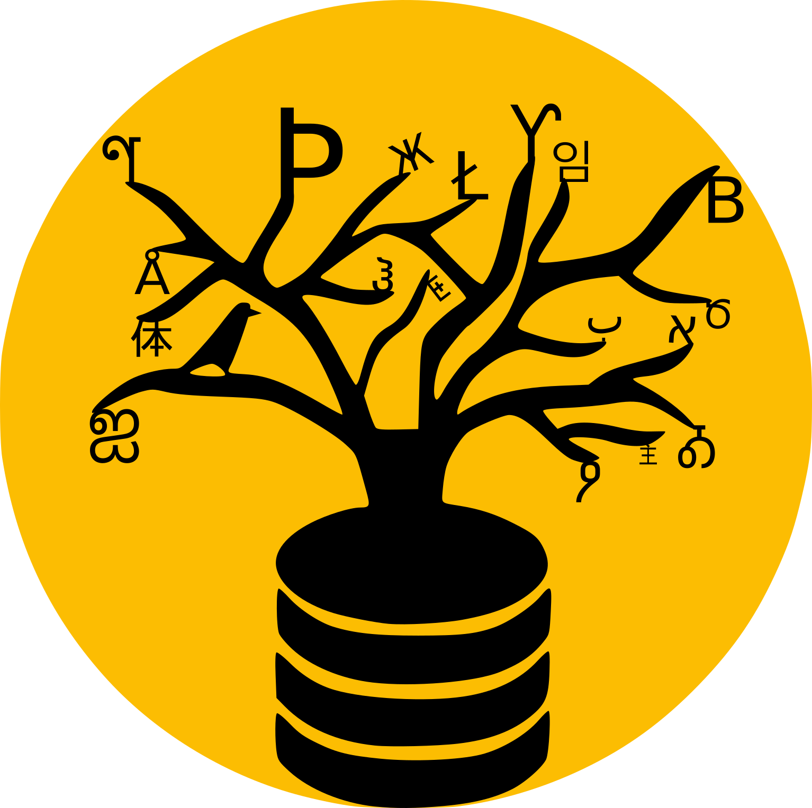

# EtymDB 2.1 
EtymDB 2.1 : An etymological database extracted from the Wiktionary (described in Methodological Aspects of Developing and Managing an Etymological Lexical Resource: Introducing EtymDB-2.0).

Previous versions available [here](https://team.inria.fr/almanach/etymdb/). 
Logo upgraded by [Alix Chagué](https://alix-tz.github.io/).

## Organisation of the repo (and the base)
- *data* 
	- *etymdb.csv* is the **raw extracted DB** csv file 
		- Extracted from wiktionary.xml, itself extracted from enwiktionary-latest-pages-articles.xml - neither have been added to the repo because of their size, if you need them, please contact the repo owner
	- *split\_etymdb* contains the extracted database, separated in several files for easier data analysis
		- *etymdb\_values*: Word ix, Lang identifier (in [wiki code](https://en.wiktionary.org/wiki/Wiktionary:List_of_languages)), Lexeme, Gloss (English translation)   
		- *etymdb\_links\_info*: Direct relation type, child word ix, parent word ix 
			- If the parent index is negative (usually for derivation or compounding relations), it means that several parents are implied: the negative index will be found in etymdb\_links\_index, in association with the several parents indices
		- *etymdb\_links\_index*: Multiple parents relation ix, parent 1 ix, parent 2 ix, ... parent n ix

- *extraction_scripts* contains all the scripts used for data extraction, included for reproducibility
- *analysis_notebooks* contains 2 Jupyter notebooks to help you get a quick start with the database. One is the reproduction of part 7 of the paper
- *static* contains the logos

## Data extraction
You can reproduce all steps of data extraction by using the following commands on your [data dump of interest](https://dumps.wikimedia.org/enwiktionary/latest/). 

### Extract your data dump
Download and extract the xml data dump that you want to use, and put it in `data/`.

```
tar -xvjf enwiktionary-date-pages-articles.xml.bz2 
mv enwiktionary-date-pages-articles.xml data/
```

### From xml to csv
Then, from the script folder.

```
cat ../data/enwiktionary-date-pages-articles.xml | perl enwiktionary2xml.pl > ../data/enwiktionary.xml
cat ../data/enwiktionary.xml | perl etymology_analyser.pl > ../data/enwiktionary.csv
```

### From csv to split csv
From the data folder.

```
# Get only links_info
awk '$1 ~ /^-/'etymdb.csv > split_etymdb/etymdb_links_index.csv
# Get no links info
awk '$1 !~ /^-/'etymdb.csv > split_etymdb/etymdb_not_links_index.csv
# Get only lexeme info
awk 'NF > 3 { print $0 }' split_etymdb/etymdb_not_links_index.csv > split_etymdb/etymdb_values.csv
# Get values info
awk 'NF == 3 { print $0 }' split_etymdb/etymdb_not_links_index.csv > split_etymdb/etymdb_links_info.csv
```

## Citation
```
@inproceedings{fourrier20,
  TITLE = {{Methodological Aspects of Developing and Managing an Etymological Lexical Resource: Introducing {EtymDB-2.0}}},
  AUTHOR = {Fourrier, Cl{\'e}mentine and Sagot, Beno{\^i}t},
  BOOKTITLE = {{Twelfth International Conference on Language Resources and Evaluation (LREC 2020)}},
  ADDRESS = {Marseilles, France},
  YEAR = {2020},
  PAGES = "3207--3216",
}
